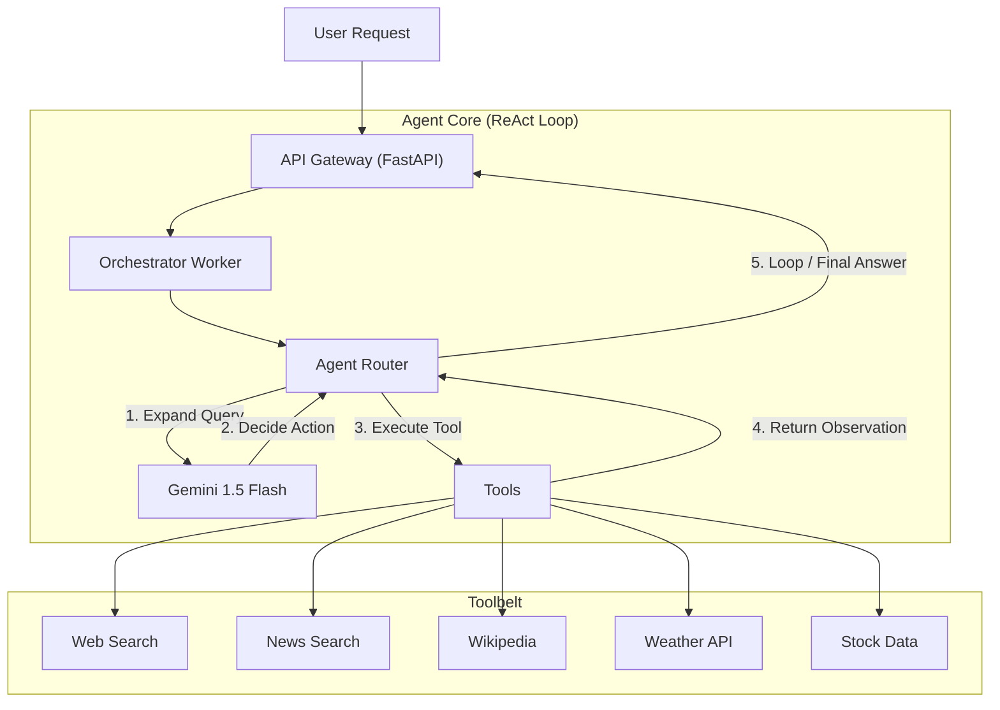

# 🕵️‍♂️ VeriVerse Misinformation Detection Agent


**VeriVerse** is an autonomous AI agent designed to combat misinformation. It combines the reasoning power of **Google Gemini** with real-time web search tools to verify facts, debunk myths, and provide cited, trustworthy answers.

---

## 🌟 Why VeriVerse?

In an era of AI hallucinations and fake news, VeriVerse stands out by prioritizing **accuracy over creativity**.

- **🛡️ Anti-Hallucination**: Unlike standard LLMs, VeriVerse **must** cite its sources. If it can't find evidence, it admits it.
- **🔄 Self-Correcting**: Uses a **ReAct (Reasoning + Acting)** loop. If a search fails, it adjusts its query and tries again.
- **⚡ Real-Time Knowledge**: Connected to the live internet, not limited by training data cutoffs.
- **🧹 Clean & Safe**: Built-in guardrails against harmful content and automatic output cleaning for seamless frontend integration.

---

## 🏗️ Architecture

VeriVerse uses a modular **Orchestrator-Worker** pattern to manage complex verification tasks.



---

## ✨ Key Features

### 🧠 Advanced Reasoning
- **Query Expansion**: Automatically rewrites vague queries (e.g., "cricket news") into specific, high-quality search prompts.
- **Fallback Logic**: Robust error handling ensures the agent never crashes, even if external APIs hiccup.
- **Loop Detection**: Smart logic prevents the agent from getting stuck in repetitive search cycles.

### 🛡️ Robustness & Safety
- **Guardrails**: Instantly refuses harmful or illegal requests without wasting resources.
- **Unicode Normalization**: Automatically fixes "smart quotes", non-breaking spaces, and encoding artifacts for pristine JSON output.
- **Port Conflict Resolution**: Smartly defaults to port `8000` to avoid conflicts with macOS system services (like AirPlay).

### 📊 Dynamic Confidence
- **Real-Time Scoring**: The agent evaluates its own answer against the retrieved evidence to assign a confidence score (0.0 - 1.0).
- **Evidence-Based**: Higher scores are only awarded when multiple reliable sources confirm the facts.

---

## 🛠️ Tools

| Tool | Description |
| :--- | :--- |
| `web_search` | Deep web search for current events and facts. |
| `get_news` | Fetch the latest headlines and articles. |
| `wikipedia` | Retrieve detailed, factual summaries. |
| `get_weather` | Real-time weather conditions and humidity. |
| `get_stock_price` | Live stock market data. |
| `calculator` | Precise mathematical calculations. |
| `get_time` | Accurate local time lookup. |

---

## 🚀 Getting Started

### 1. Prerequisites
- Python 3.9+
- API Keys for **Google Gemini** and **Search Provider**.

### 2. Installation
```bash
# Clone the repository
git clone https://github.com/aneeshamanke/Mumbai_Hacks.git
cd Mumbai_Hacks

# Install dependencies
pip install -r requirements.txt
```

### 3. Configuration
Create a `config/.env` file:
```ini
GEMINI_API_KEY=your_gemini_key_here
TAVILY_API_KEY=your_search_key_here
```

### 4. Run the Server
```bash
python3 api_gateway/main.py
```
*Server starts on `http://0.0.0.0:8000`*

---

## 🔌 API Reference

### `POST /prompts`
Submit a query for verification.

**Request:**
```json
{
  "prompt": "Is the earth flat?",
  "user_id": "user_123"
}
```

**Response:**
```json
{
  "run_id": "550e8400-e29b...",
  "status": "completed",
  "provisional_answer": "The Earth is an oblate spheroid, not flat. There is overwhelming scientific evidence...",
  "confidence": 0.98,
  "sources": ["https://en.wikipedia.org/wiki/Earth"],
  "steps": [
    {
      "step": 1,
      "tool": "wikipedia",
      "thought": "I need to check scientific consensus on Earth's shape.",
      "tool_input": {"query": "Shape of Earth"},
      "tool_output": "Earth is an oblate spheroid..."
    }
  ]
}
```

---

## 🧪 Testing

Run the included test suite to verify functionality:
```bash
python3 scripts/test_agent.py       # Full agent loop
python3 scripts/test_unicode.py     # Output cleaning logic
```

---
*Built with ❤️ for Mumbai Hacks.*
